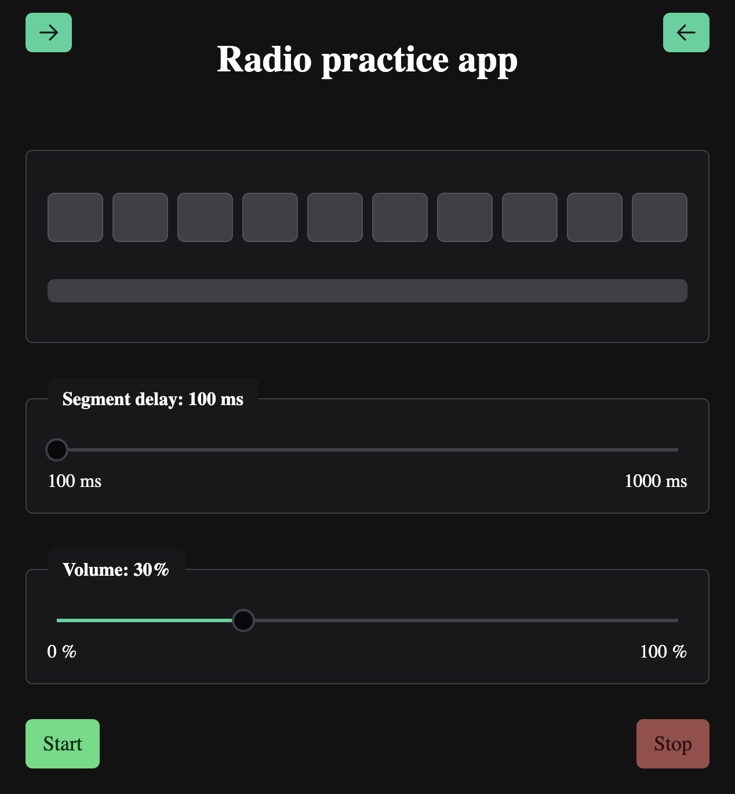

# Radio

A simple Angular application designed to help practice radio communication by playing audio segments similar to the military alphabet.  
Users can type what they hear, and the app provides feedback on their accuracy.



## Features

- Plays random sequences of NATO phonetic alphabet audio
- Users input what they hear in real-time
- Instant feedback on correct vs incorrect letters
- Result logging for each attempt
- A control panel allows playback of all possible sounds
- Adjustable delay between audio segments
- Adjustable playback volume
- Responsive layout using PrimeNG components

## Tech Stack

- [Angular](https://angular.io/)
- [PrimeNG](https://www.primefaces.org/primeng/) UI library
- [TypeScript](https://www.typescriptlang.org/)
- [SCSS](https://sass-lang.com/)
- [LocalStorage](https://developer.mozilla.org/en-US/docs/Web/API/Window/localStorage) for saving logs

## Installation & Running

```bash
git clone https://github.com/Z-5-0/radio.git radio
cd radio
npm install
ng serve
```

## TODO
- Add multilanguage support

## Licence
MIT © Z-5-0
